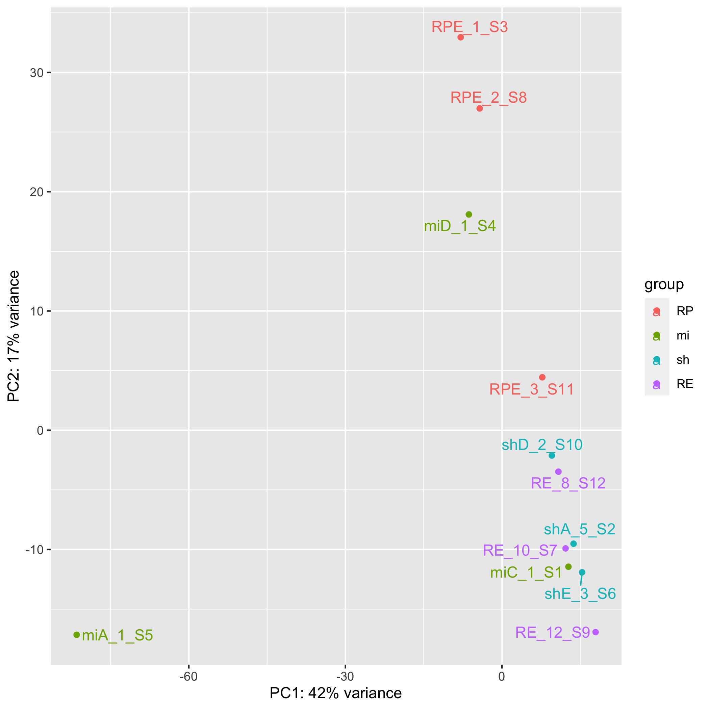
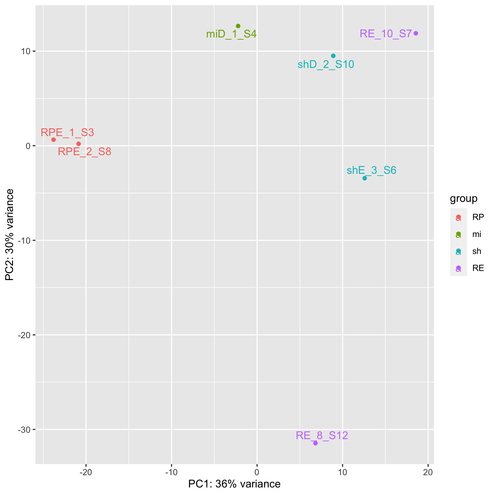

# Results

## Total RNA libraries

### transcriptome + kallisto

An initial PCA plot indicates that sample miA_1_S5 is an outlier. It will be removed before further analysis. 

No single samples explain huge amounts of variance in this plot, so it's improved. However, we don't see any grouping of treatments, which foreshadows ambiguous results to come. 

Heatmap of top l2fc genes for RE vs RPE

Heatmap of top l2fc genes for sh vs RPE